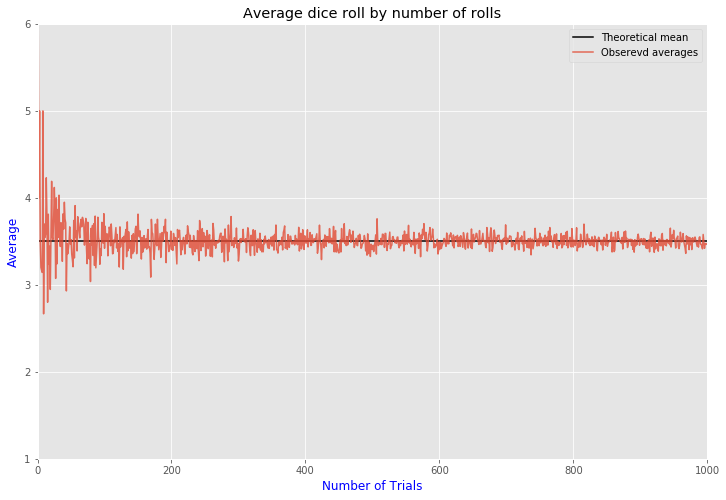

### THE LAW OF LARGE NUMBERS

An illustration of the law of large numbers using a particular run of rolls of a single die. As the number of rolls in this run increases, the average of the values of all the results approaches 3.5. Although each run would show a distinctive shape over a small number of throws (at the left), over a large number of rolls (to the right) the shapes would be extremely similar.